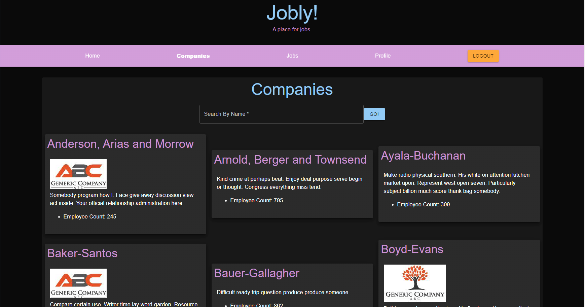

# Jobly

Job board to find the right job from the company you want & apply to it.

[Visit the page][live]



## Features

- Create an account, edit your profile

- View companies that have jobs available for hire

- View jobs that are available to apply to

- Find jobs by specific companies, & even search by company name

## Technologies Used

- React (JavaScript)

  - React Router

  - Material UI

- SASS

- Axios

- Node.js / Express.js

- Jest

  - React Testing Library

  - Supertest

- PostgreSQL

- JSON Web Token

## Setup & Running

1. Clone this repository

   ```bash
   git clone <link> <location>
   ```

### Frontend

Built with [Create React App][cra].

1. Install the NPM dependencies.

   ```bash
   npm i
   ```

1. Use the NPM scripts

   - Running in development mode

     ```bash
     npm run start
     ```

   - Create production build

     ```bash
     npm run build
     ```

Optional environment variable setup

`REACT_APP_BASE_URL` the base API URL, defaults to `http://localhost:3001`

### Backend

1. Install the NPM dependencies.

   ```bash
   npm i
   ```

1. Setup the PostgreSQL database with the `jobly.sql` file

   ```bash
   psql < jobly.sql
   ```

1. Use the NPM scripts

   - Running in development mode

     ```bash
     npm run dev
     ```

   - Running production mode

     ```bash
     npm run start
     ```

   - Running the code tests

     ```bash
     npm run test
     ```

[live]: https://mc-jobly-react.surge.sh/
[cra]: https://create-react-app.dev/
